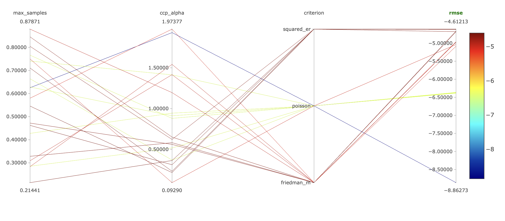
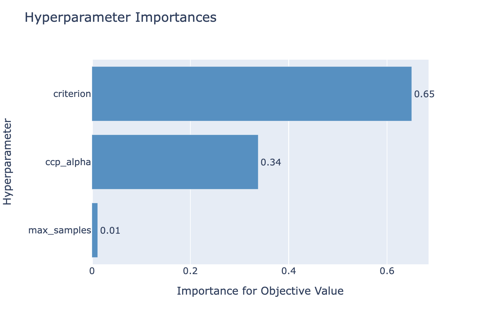

# Model deployment project
[DRAFT]

## Steps I took
Steps

* I created a firewall rule to access an MLflow tracking server
* I created a compute engine instance with 2 vCPUs and 4GB memory
* I created a postgreSQL instance to store the MLflow metadata
* I created a GCS Bucket to store the artifacts
* On the compute instance I installed

sudo apt-get update
sudo apt-get install git python3-pip make build-essential libssl-dev zlib1g-dev libbz2-dev libreadline-dev libsqlite3-dev wget curl llvm libncurses5-dev libncursesw5-dev xz-utils tk-dev libffi-dev liblzma-dev python-openssl
curl https://pyenv.run | bash
pyenv install 3.10.11
pyenv global 3.10.11
python -m venv mlflow
source mlflow/bin/activate
pip install mlflow boto3 google-cloud-storage psycopg2-binary

mlflow server \
 -h 0.0.0.0 \
 -p 5000 \
 --backend-store-uri postgresql://mlflow-user:'<password>'@10.53.48.3:5432/mlflow-db \
 --default-artifact-root gs://mlflow-artifacts/default


 Accessible via: http://35.246.210.0:5000 


 * I started the MLflow server with the compute instance URI and set-up an experiment







Built the fastapi app in [webservice](./webservice/)

Open up an artifact registry 

Built and pushed the docker container to the registry 
```bash
docker buildx build --no-cache --platform linux/amd64 --push -t europe-west3-docker.pkg.dev/ml-neuefische/docker-registry/webservice-taxi-prediction:latest  .
``````

# Model deployment project

## Project description

In this project you will `train` and `deploy` a `machine learning model` on the `yellow taxi` dataset. The goal is to predict the `duration` of a trip.
You should use the `scikit-learn` library to train a `random forest regressor` model.
And deploy the model with one of the methods you saw this week.

## Project structure

The project is composed of 3 parts:

- Train the model with a `random forest regressor` track it with MLFlow.
- Deploy the model as an API.
- Make a request to the model.

Bonus tasks if you have the time:

Bonus: Use the testing methods you saw this week to test your data and your model.

Bonus: Use `gridsearch` or `optuna` to find the best hyperparameters for your model.

## Dataset

Yellow taxi dataset: https://www1.nyc.gov/site/tlc/about/tlc-trip-record-data.page

- Year 2021
- Month 01


## Answer these questions

1. What is the RMSE of your model?
2. What would you do differently if you had more time?


## How to submit your project

Upload your project on GitHub and send us the link. Answer the questions above in the README.md file.